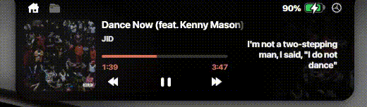
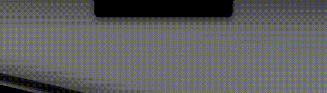
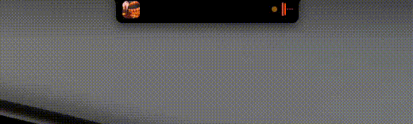
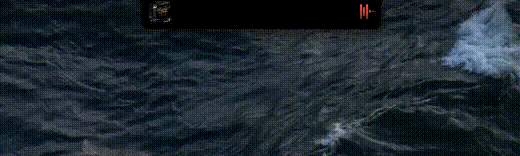
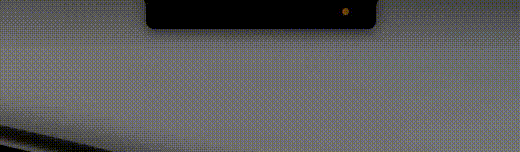
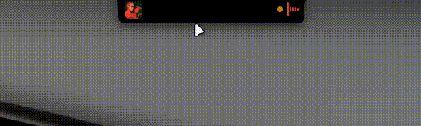
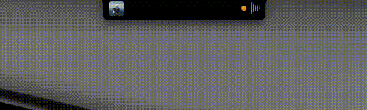
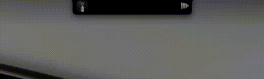

  

<h1 align="center">V-Notch</h1>

  <b>macOS Notch for Windows — Smart Notch Experience</b>

  
  
  
  

  V-Notch brings the Dynamic Island experience from Apple devices to your Windows PC. 
  A smart, interactive notch that displays media controls, system info, and notifications with smooth animations.

  MyDockFinder 100% compatible for immersive experience ! 

  This project is entirely <b>non-profit</b> and <b>free</b>. 
  If you'd like to support my work, you can donate at: <a href="https://www.paypal.me/PhuocLe678"><b>PayPal</b></a>

---

## Preview

  These previews are from version 1.6, maybe changed in later versions.

<table>
  <tr>
    <td align="center" width="50%">
       
      <b>Media Pill</b> 
      macOS notch-style media pill — control Spotify, YouTube, Apple Music and more with real-time progress, volume control, and album art.
    </td>
    <td align="center" width="50%">
       
      <b>Spotify Integration</b> 
      Full Spotify support with smart-cropped album art, color-adaptive UI, seamless playback control, and real-time synced lyrics (covers ~90% of global tracks).
    </td>
  </tr>
  <tr>
    <td align="center" width="50%">
       
      <b>File Shelf</b> 
      Drag & drop files onto the notch for quick temporary storage. Pick them up later and drop into any app.
    </td>
    <td align="center" width="50%">
       
      <b>Clipboard Notification</b> 
      Get a visual confirmation on the notch whenever you copy something to the clipboard.
    </td>
  </tr>
  <tr>
    <td align="center" width="50%">
       
      <b>Say hello to Dynamic Island</b> 
      Experience the signature Apple-style Dynamic Island on your Windows desktop. Enjoy smooth, fluid animations that seamlessly blend with your workflow, bringing notifications and media controls to life.
    </td>
    <td align="center" width="50%">
       
      <b>Privacy Indicators</b> 
      Know when your camera or microphone is in use with a clear visual indicator on the notch.
    </td>
  </tr>
  <tr>
    <td align="center" width="50%">
       
      <b>Volume Control</b> 
      A color-adaptive volume slider that matches the dominant color of the current track, so you always know what you're adjusting just by scrolling.
    </td>
    <td align="center" width="50%">
       
      <b>Camera Preview</b> 
      Live camera feed right inside the notch — quickly check yourself without opening any app. And NO, VNotch not going to record that.
    </td>
  </tr>
  <tr>
  <td align="center" width="50%">
       
      <b>Gesture Controls</b> 
      Hold and drag the notch left or right to skip or rewind media, or drag down to quickly open the file tray.
    </td>
    <td align="center" width="50%">
       
      <b>Settings & Customization</b> 
      Fine-tune your experience — choose monitor, language, startup behavior, and more.
    </td>
  </tr>
</table>

---

## Features

### Media Controls
- Control Spotify, Apple Music, YouTube, SoundCloud, TikTok and more directly from the notch
- Intelligent media detection combining Windows SMTC and process monitoring
- Real-time progress bar with high-precision seeking and elapsed/remaining time display
- Automatic thumbnail fetching for YouTube, smart-cropped album art (removes Spotify branding bars)
- Color-adaptive UI based on album art using HSL color analysis

### File Shelf
- Dynamic clipboard for files — drag and drop files to store temporarily
- Lasso selection for multi-file picking
- Drag files out to any application (Explorer, Discord, Email, etc.)
- Compact grid layout with thread-safe file management

### System Widgets
- Battery status with charging animation
- Integrated calendar and clock
- Camera indicator

### Animation & UI
- Apple-style expand/collapse transitions configurable up to 120 FPS
- Glassmorphism blur effects with hardware acceleration
- Glow engine — real-time HSL color extraction for vibrant UI accents
- Spring animations for language switching and UI element transitions

### System
- **Fullscreen Aware** — Automatically hides when gaming or watching movies (supports both exclusive and windowed fullscreen)
- **Slide animation** when hiding/showing for fullscreen transitions
- **Multi-Monitor** — Choose which display shows the notch
- **Cursor Bypass** — Smart click-through that doesn't interfere with your workflow
- **Hot Corners** — Quick access via configurable screen corners
- **Auto-Update** — Checks and updates automatically from GitHub Releases
- **Start with Windows** — Launch on system startup
- **Multilingual** — English and Vietnamese with real-time switching

---

## Download & Installation

### Requirements
- Windows 10/11 (64-bit)
- [.NET 10 Desktop Runtime](https://dotnet.microsoft.com/download/dotnet/10.0)

### Install
1. Download `V-Notch-Setup.exe` from [Releases](https://github.com/rainaku/V-Notch/releases)
2. Run the installer and follow the Setup Wizard
3. Launch **V-Notch** from the Start Menu
4. (Optional) Enable "Start with Windows" in Settings

### Build the latest (without waiting for a release)
Muốn dùng code mới nhất mà chưa có bản release? Bạn có thể tự build setup ngay trên GitHub:

1. Vào tab **Actions** của repo (fork về tài khoản của bạn nếu cần).
2. Chọn workflow **Build Installer (Nightly / On-Demand)** → bấm **Run workflow**.
   Chọn **Loại build**:
   - `framework-dependent` — nhẹ, cần cài [.NET 10 Desktop Runtime](https://dotnet.microsoft.com/download/dotnet/10.0).
   - `self-contained` — chạy ngay không cần cài .NET (file lớn hơn).
   - `both` — build cả hai.
3. Khi chạy xong, tải file `.exe` ở phần **Artifacts** của lần chạy đó,
   hoặc tải trực tiếp từ prerelease **`nightly`** trong [Releases](https://github.com/rainaku/V-Notch/releases).

> Workflow cũng tự chạy mỗi khi có push vào `main`, nên prerelease `nightly` luôn là bản mới nhất.

---

## Usage

### Basic Controls
| Action | Result |
|--------|--------|
| **Hover** | Expand notch to show media controls |
| **Scroll Down** | Switch to File Shelf |
| **Scroll Up** | Switch back to Media Controls |
| **Click** | Toggle compact/expanded view |
| **Media buttons** | Play/Pause, Next/Previous, Seek |

### File Shelf
| Action | Result |
|--------|--------|
| **Drag & drop onto notch** | Add files to the shelf |
| **Lasso (drag on empty space)** | Multi-select files |
| **Ctrl + Click** | Toggle individual file selection |
| **Drag out** | Move files to any folder or app |
| **Delete** | Remove files from the shelf |

### Supported Platforms
| Platform | Capability |
|----------|------------|
| **Spotify** | Full control, smart-cropped album art |
| **Apple Music** | Native Windows app support |
| **YouTube** | Thumbnail fetching, title parsing, 15s seek |
| **TikTok/Reels** | Video title detection, basic playback |
| **SoundCloud** | Browser session detection |
| **Generic** | Any app using Windows Media Session |

---

## System Requirements

| Component | Requirement |
|-----------|-------------|
| OS | Windows 10/11 (64-bit) |
| Runtime | .NET 10 Desktop Runtime |
| RAM | >4GB for stability |
| CPU | Minimal usage |
| Display | Any resolution (adaptive positioning) |
| GPU | Any GPU should work but i do recommended a decent GPU for best performance |
---

## Privacy Policy

V-Notch does not collect, transmit, or store personal data on any external server. The application contains no analytics, telemetry, or user tracking.

Network connections are limited to:
- **GitHub API** — checking for application updates
- **YouTube / SoundCloud** — retrieving album artwork for display

All user settings are stored locally at `%APPDATA%\V-Notch\`. Camera and media data are processed in real-time for display only and are never recorded or transmitted.

Full policy: [English](https://github.com/rainaku/V-Notch/blob/main/PRIVACY_POLICY.md) | [Tiếng Việt](https://github.com/rainaku/V-Notch/blob/main/PRIVACY_POLICY_VI.md)

---

## License

Apache License 2.0 — See [LICENSE](LICENSE) for details.

---

  <b>Made with love by <a href="https://rainaku.id.vn">rainaku</a></b>

  
  
  
  

