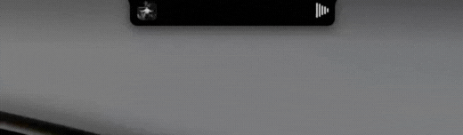
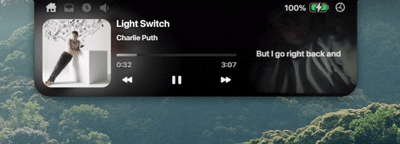
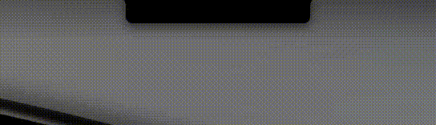
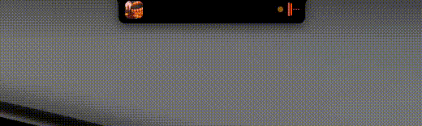
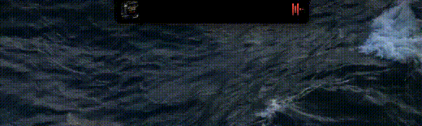
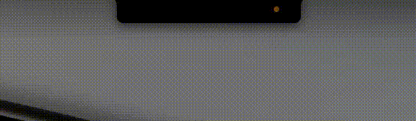
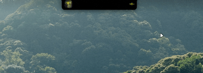
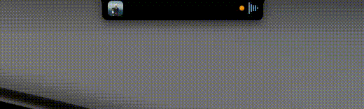
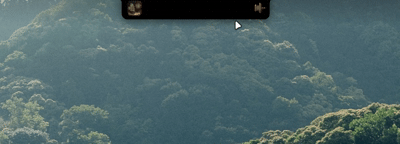
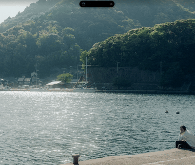

  

<h1 align="center">V-Notch</h1>

  <b>macOS Notch & Dynamic Island for Windows — Smart Ambient Desktop Experience</b>

  
  
  
  

  V-Notch brings the Apple Dynamic Island and macOS notch experience to your Windows PC. 
  A smart, interactive notch that presents live media controls, synced lyrics, Spotify Canvas, system hardware telemetry, audio mixing, Spotlight launcher, and notifications with fluid animations and realistic Liquid Glass optics.

  <b>100% compatible with MyDockFinder for an immersive desktop experience!</b>

  This project is entirely <b>free</b> and <b>open-source</b>. 
  If you enjoy using V-Notch and would like to support its continued development, you can donate via <a href="https://www.paypal.me/PhuocLe678"><b>PayPal</b></a>.

---

## Previews

  <i>Visual showcase of V-Notch core features. UI elements and animations may evolve in newer releases.</i>

<table>
  <tr>
    <td align="center" width="50%">
       
      <b>Media Pill</b> 
      macOS notch-style media pill — control Spotify, YouTube, Apple Music, and more with real-time seeking progress, volume control, and dynamic album art colors.
    </td>
    <td align="center" width="50%">
       
      <b>Spotify Integration &amp; Synced Lyrics</b> 
      Full Spotify playback integration with smart-cropped album art, color-adaptive gradients, real-time synced lyrics (LRCLIB &amp; lrc mux), and Spotify Canvas video backgrounds.
    </td>
  </tr>
  <tr>
    <td align="center" width="50%">
       
      <b>File Shelf</b> 
      Drag &amp; drop files onto the notch for quick temporary staging. Select with lasso or pick them up later to drop into any app.
    </td>
    <td align="center" width="50%">
       
      <b>Clipboard Peek &amp; Notification</b> 
      Get immediate visual confirmation and content previews on the notch whenever you copy text or images to the clipboard.
    </td>
  </tr>
  <tr>
    <td align="center" width="50%">
       
      <b>Dynamic Island Mode</b> 
      Experience the signature Apple-style floating Dynamic Island on your Windows desktop. Enjoy fluid spring physics and realistic Liquid Glass optical refraction.
    </td>
    <td align="center" width="50%">
       
      <b>Privacy Indicators</b> 
      Instantly know when your camera, microphone, or screen recording is in use by any system application with subtle colored indicator dots.
    </td>
  </tr>
  <tr>
    <td align="center" width="50%">
       
      <b>Volume &amp; Audio Mixer</b> 
      Color-adaptive master volume slider matching current album art, plus an integrated multi-app audio mixer to adjust individual application levels.
    </td>
    <td align="center" width="50%">
       
      <b>Camera Preview</b> 
      Live local camera mirror inside the notch — quickly check your appearance without opening separate software. Frames are never recorded or stored.
    </td>
  </tr>
  <tr>
    <td align="center" width="50%">
       
      <b>Gesture Controls</b> 
      Swipe left or right across the notch to skip or rewind media, scroll to switch views, or swipe down to immediately access the File Shelf.
    </td>
    <td align="center" width="50%">
       
      <b>Rich Customization &amp; Settings</b> 
      Fine-tune notch dimensions, glass presets, monitor selection, auto-start behavior, hot corners, and 7 supported languages.
    </td>
  </tr>
  <tr>
    <td align="center" width="50%">
       
      <b>Spotlight Search (<code>Alt + Space</code>)</b> 
      Lightning-fast application and file search powered by Windows Search and voidtools Everything IPC, complete with an inline math calculator.
    </td>
    <td align="center" width="50%">
       
      <b>Liquid Glass Optics Engine</b> 
      Real-time DirectX 11 screen sampling, chromatic aberration, rim specular highlights, edge refraction, and interactive touch light glow.
    </td>
  </tr>
</table>

---

## Features

### Media Controls & Synced Lyrics
- Control Spotify, Apple Music, YouTube, SoundCloud, Tidal, TikTok/Reels, and any Windows Media Session (SMTC) source.
- High-precision progress tracking with smooth seeking, time elapsed, and time remaining.
- Real-time synced lyrics powered by LRCLIB and lrc mux fallback aggregator.
- Timed YouTube closed captions and subtitles via YoutubeExplode.
- Optional Spotify Canvas video background streaming (session encrypted locally with Windows DPAPI).
- On-device smart artwork cropping powered by local YOLO11n ONNX object detection (centers faces/subjects and removes banner borders).
- Dynamic color-adaptive gradients and glows extracted using HSL color analysis.

### Spotlight Search Launcher (`Alt + Space`)
- Instant app launching for Start Menu shortcuts and installed Windows applications.
- File and folder search powered by local Windows Search (OLE DB) and voidtools Everything IPC.
- Built-in inline math evaluator for arithmetic and algebraic calculations using MathNet.Numerics.
- Intelligent local launch ranking (capped at 100 entries, stored 100% locally).

### File Shelf
- Floating staging shelf for files — drag and drop items onto the notch for quick temporary storage.
- Multi-file lasso selection and keyboard shortcuts.
- Drag staged files out to any application (Windows Explorer, Discord, browser uploads, email clients).

### Audio Mixer & System Monitor
- Live per-app audio mixer to independently adjust volume levels across active programs.
- Real-time hardware performance monitor displaying CPU usage %, physical RAM consumption, and GPU utilization.

### Liquid Glass Optics Engine
- Real-time desktop backdrop sampling via DXGI Desktop Duplication and Windows Magnification API.
- Physically inspired optical refraction, chromatic aberration, bevel lighting, and edge bending.
- Interactive Touch Light reactive specular highlights and ambient overhead illumination.

### Ambient Widgets & Tools
- Digital and analog clock widgets with customizable greetings.
- Interactive monthly calendar and world clock.
- Configurable countdown timer and stopwatch with progress tracking.
- Weather forecast widget with temperature, daily highs/lows, and conditions via Open-Meteo.

### Privacy & System Integration
- Real-time privacy dots for active microphone, webcam, and screen recording sensors.
- Bluetooth device connection notifications and accessory battery level monitoring.
- Clipboard change confirmation badge with optional preview.
- Fullscreen auto-hide (supports both exclusive and windowed fullscreen for games and media).
- Multi-monitor support — position the notch on any connected display.
- Multilingual support across **7 languages**: English, Vietnamese, Spanish, French, German, Japanese, and Hindi with instantaneous live switching.

---

## Download &amp; Installation

### Requirements
- **Operating System:** Windows 10 (version 19041+) or Windows 11 (64-bit)
- **Runtime:** [.NET 8 Desktop Runtime](https://dotnet.microsoft.com/download/dotnet/8.0) or [.NET 10 Desktop Runtime](https://dotnet.microsoft.com/download/dotnet/10.0) *(or download the Self-Contained installer which includes the runtime)*
- **Hardware:** Decent GPU recommended for hardware-accelerated Liquid Glass refraction and smooth 60–120 FPS animations.

### Install from Releases
1. Download `V-Notch-Setup.exe` (or `V-Notch-Setup-SelfContained.exe`) from [Releases](https://github.com/rainaku/V-Notch/releases).
2. Run the installer and complete the Setup Wizard.
3. Launch **V-Notch** from your Start Menu or desktop shortcut.
4. *(Optional)* Enable "Start with Windows" in Settings.

### Build the Latest Version (GitHub Actions)
To use the latest development build directly from GitHub Actions without waiting for an official release:

1. Go to the **Actions** tab of this repository (or your fork).
2. Select the **Release Installer** workflow and click **Run workflow**.
3. Choose your desired build variant:
   - `framework-dependent` — smaller download, requires [.NET Desktop Runtime](https://dotnet.microsoft.com/download/dotnet).
   - `self-contained` — standalone package, runs out-of-the-box without separate .NET installation.
4. When the build completes, download the setup executable from the **Artifacts** section or the automated **`nightly`** release.

---

## Usage &amp; Shortcuts

### Basic Navigation
| Action | Description |
|---|---|
| **Hover** | Expands the notch to reveal media controls and widgets |
| **Scroll Down** | Switch to File Shelf view |
| **Scroll Up** | Switch back to Media Controls |
| **Click / Tap** | Toggle between compact pill and expanded view |
| **Swipe Left / Right** | Skip to next or previous audio track |
| **Swipe Down** | Quickly open the File Shelf |
| **`Alt + Space`** | Open or close the Spotlight Search launcher |
| **`↑` / `↓`, `Enter`, `Esc`** | Navigate search results, launch selected item, or dismiss Spotlight |

### File Shelf
| Action | Description |
|---|---|
| **Drag &amp; Drop onto Notch** | Stage files into the shelf |
| **Lasso Drag (on empty area)** | Select multiple staged files |
| **`Ctrl + Click`** | Toggle individual file selection |
| **Drag Out** | Move staged files into any destination app or directory |
| **`Delete`** | Remove selected items from the shelf |

---

## Privacy Policy

V-Notch is built with a **strict local-first architecture**. It contains no telemetry, no analytics, no advertising, and no tracking identifiers.

Network communication is strictly limited to user-driven or functional features:
- **GitHub Releases API** — Checking for application updates.
- **LRCLIB / lrc mux** — Retrieving synchronized song lyrics for the current track.
- **YouTube / SoundCloud** — Fetching public thumbnails and captions.
- **Spotify Web Services** — Optional Spotify Canvas video background streaming (credentials protected with Windows DPAPI).
- **Open-Meteo / ipwho.is** — Optional weather forecast queries.

All user preferences, cache records, and launch statistics are stored locally on your machine at `%APPDATA%\V-Notch\`.

Read the complete Privacy Policy:
- [English Privacy Policy](PRIVACY_POLICY.md)
- [Chính Sách Bảo Mật (Tiếng Việt)](PRIVACY_POLICY_VI.md)

---

## License

This project is licensed under the **Apache License 2.0**. See the [LICENSE](LICENSE) file for details.

---

  <b>Developed with ❤️ by <a href="https://rainaku.id.vn">rainaku</a></b>

  
  
  
  

