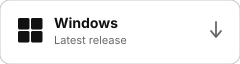
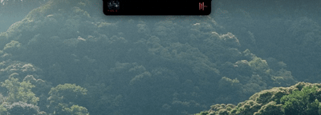
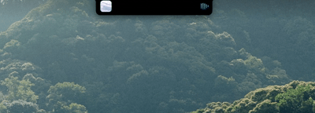
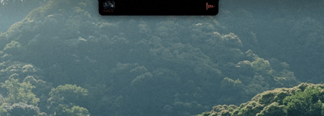
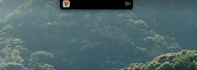
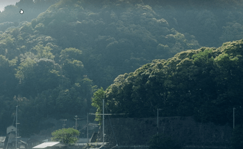
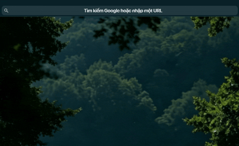
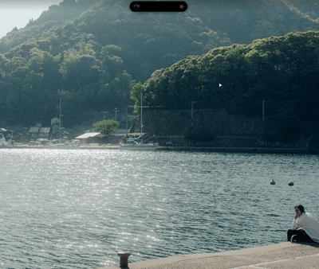

  

<h2 align="center">V-Notch</h2>

  macOS Dynamic Island and notch for Windows

  
  
  
  
  

  <a href="https://github.com/rainaku/V-Notch/releases/latest">Download</a> ·
  <a href="#usage">Usage</a> ·
  <a href="#installation">Installation</a> ·
  <a href="#privacy">Privacy</a> ·
  <a href="https://v-notch.vercel.app">Website</a>

  

  <a href="https://github.com/rainaku/V-Notch/releases">All releases</a>

  V-Notch puts a notch at the top of your screen that shows what you need: media controls, synced lyrics, system stats, privacy indicators, and a Spotlight launcher. It runs as a compact pill or expands into a floating Dynamic Island. Compatible with MyDockFinder.

  <b>Free and open source forever.</b>

  V-Notch is crafted independently with care and passion. 
  If it elevates your daily workflow, consider <a href="https://www.paypal.me/PhuocLe678"><b>supporting development via PayPal</b></a>.

---

<table align="center">
  <tr>
    <td align="center" valign="top" width="50%">
       
      <b>Dynamic Island mode</b> 
      Floating pill with spring physics and Liquid Glass refraction.
    </td>
    <td align="center" valign="top" width="50%">
       
      <b>Media controls</b> 
      Playback controls, album art, volume, and real-time seek bar.
    </td>
  </tr>
  <tr>
    <td align="center" valign="top" width="50%">
       
      <b>Spotify &amp; synced lyrics</b> 
      Real-time lyrics, dynamic color gradients, and Canvas backgrounds.
    </td>
    <td align="center" valign="top" width="50%">
       
      <b>Volume &amp; audio mixer</b> 
      Per-app volume mixer alongside master slider matching album art.
    </td>
  </tr>
  <tr>
    <td align="center" valign="top" width="50%">
       
      <b>File shelf</b> 
      Drop files onto notch to stage, drag back out to any app when ready.
    </td>
    <td align="center" valign="top" width="50%">
       
      <b>Gestures</b> 
      Swipe to skip tracks, scroll to switch views, swipe down for shelf.
    </td>
  </tr>
  <tr>
    <td align="center" valign="top" colspan="2">
       
      <b>Clipboard notification</b> 
      Instant visual feedback and content preview when copying text or images.
    </td>
  </tr>
  <tr>
    <td align="center" valign="top" width="50%">
       
      <b>Liquid Glass optics</b> 
      DirectX 11 rendering with chromatic aberration and edge refraction.
    </td>
    <td align="center" valign="top" width="50%">
       
      <b>Stay behind windows</b> 
      Keeps notch on desktop layer so maximized apps are never covered.
    </td>
  </tr>
  <tr>
    <td align="center" valign="top" width="50%">
       
      <b>Spotlight search</b> 
      Fast app and file launcher (Alt+Space) with math calculator.
    </td>
    <td align="center" valign="top" width="50%">
       
      <b>Settings</b> 
      Config and custom the Notch however you like.
    </td>
  </tr>
</table>

---

## Usage

| Action                     | Result                        |
| -------------------------- | ----------------------------- |
| Hover                      | Expands the notch             |
| Click                      | Toggle pill / expanded view   |
| Middle click               | Play / pause media            |
| Scroll down                | Switch to file shelf          |
| Scroll up                  | Switch back to media controls |
| Swipe left / right         | Previous / next track         |
| Swipe down                 | Open file shelf               |
| `Alt + Space`              | Open or close Spotlight       |
| `Up` / `Down` in Spotlight | Move through results          |
| `Enter`                    | Launch selected item          |
| `Esc`                      | Close Spotlight               |

<strong>File shelf actions</strong>

| Action          | Result                       |
| --------------- | ---------------------------- |
| Drag onto notch | Stage files                  |
| Lasso drag      | Select multiple staged files |
| `Ctrl + Click`  | Toggle selection             |
| Drag out        | Move to any target           |
| `Delete`        | Remove selected files        |

---

## Installation

Windows 10 build 19041 or later, or Windows 11 (64-bit). Requires [.NET 8 Desktop Runtime](https://dotnet.microsoft.com/download/dotnet/8.0) or [.NET 10 Desktop Runtime](https://dotnet.microsoft.com/download/dotnet/10.0). The Self-Contained installer bundles the runtime, so you can skip that step if you use it. A dedicated GPU is recommended for Liquid Glass at 60-120 FPS.

1. Download `V-Notch-Setup.exe` from [Releases](https://github.com/rainaku/V-Notch/releases). Use `V-Notch-Setup-SelfContained.exe` to skip the .NET install.
2. Run the installer.
3. Launch V-Notch from the Start Menu or desktop shortcut.
4. Optionally enable "Start with Windows" in Settings.

<strong>Building from GitHub Actions</strong>

Go to the Actions tab, select Release Installer, and click Run workflow. Choose `framework-dependent` (smaller, requires .NET runtime) or `self-contained` (standalone). Download the installer from Artifacts when the build finishes, or from the automated `nightly` release tag.

---

## Privacy

No telemetry, analytics, or tracking of any kind. Network requests are limited to:

| Service               | Purpose                                                                 |
| --------------------- | ----------------------------------------------------------------------- |
| GitHub Releases API   | Update checks                                                           |
| LRCLIB / lrc mux      | Synced lyrics                                                           |
| YouTube / SoundCloud  | Public thumbnails and captions                                          |
| Spotify Web Services  | Canvas backgrounds — optional, credentials encrypted with Windows DPAPI |
| Open-Meteo / ipwho.is | Weather — optional                                                      |

All settings and caches are stored locally at `%APPDATA%\V-Notch\`.

[Privacy Policy](PRIVACY_POLICY.md) · [Tiếng Việt](PRIVACY_POLICY_VI.md) · [Terms of Service](TERMS_OF_SERVICE.md) · [Tiếng Việt](TERMS_OF_SERVICE_VI.md)

---

## Star history

A heartfelt thank you to everyone who starred and supported V-Notch from the very early days. Your early belief, feedback, and stars gave this project life and continue to inspire every single update! ⭐

---

## License

Apache License 2.0. See [LICENSE](LICENSE). Third-party notices in [THIRD_PARTY_NOTICES.md](THIRD_PARTY_NOTICES.md).

---

  Made by <a href="https://rainaku.id.vn">rainaku</a> ·
  <a href="https://v-notch.vercel.app">Website</a> ·
  <a href="https://github.com/rainaku/V-Notch">GitHub</a> ·
  <a href="https://www.facebook.com/rain.107/">Facebook</a> ·
  <a href="https://www.paypal.me/PhuocLe678">Donate</a>

