

  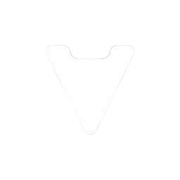

<h2 align="center">V-Notch</h2>

  macOS Dynamic Island and notch for Windows

  
  
  
  
  

  <a href="https://github.com/rainaku/V-Notch/releases/latest">Download</a> ·
  <a href="#usage">Usage</a> ·
  <a href="#installation">Installation</a> ·
  <a href="#privacy">Privacy</a> ·
  <a href="https://v-notch.vercel.app">Website</a>

  <a href="https://github.com/rainaku/V-Notch/releases/latest">
    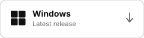
  </a>

  <a href="https://github.com/rainaku/V-Notch/releases">All releases</a>

  V-Notch adds media controls, synced lyrics, system stats, privacy indicators, and a Spotlight launcher to the top of your screen. Use it as a compact pill or expand it into a floating Dynamic Island. It works with MyDockFinder.

  <b>Free and open source forever.</b>

  V-Notch is an independent project. 
  If you use it regularly, you can <a href="https://www.paypal.me/PhuocLe678"><b>support development via PayPal</b></a>.

<table align="center">
  <tr>
    <td align="center" valign="top" width="50%">
      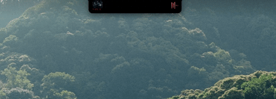 
      <b>Dynamic Island mode</b> 
      A floating pill with spring animations and Liquid Glass refraction.
    </td>
    <td align="center" valign="top" width="50%">
      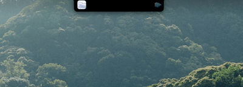 
      <b>Media controls</b> 
      Control playback and volume, view album art, and seek through the current track.
    </td>
  </tr>
  <tr>
    <td align="center" valign="top" width="50%">
      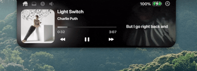 
      <b>Spotify &amp; synced lyrics</b> 
      Follow synced lyrics over changing color gradients or Canvas backgrounds.
    </td>
    <td align="center" valign="top" width="50%">
      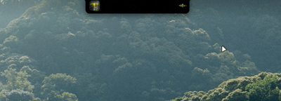 
      <b>Volume &amp; audio mixer</b> 
      Adjust each app’s volume or use the master slider, styled to match the album art.
    </td>
  </tr>
  <tr>
    <td align="center" valign="top" width="50%">
      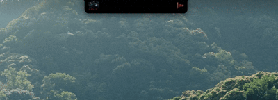 
      <b>File shelf</b> 
      Drop files onto the notch, then drag them into another app when you need them.
    </td>
    <td align="center" valign="top" width="50%">
      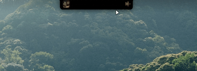 
      <b>Gestures</b> 
      Swipe left or right to change tracks. Scroll to switch views, or swipe down to open the shelf.
    </td>
  </tr>
  <tr>
    <td align="center" valign="top" colspan="2">
      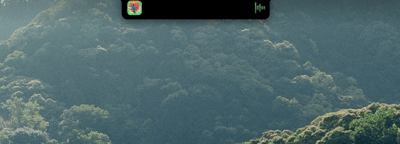 
      <b>Clipboard notification</b> 
      See a notification and preview when you copy text or images.
    </td>
  </tr>
  <tr>
    <td align="center" valign="top" width="50%">
       
      <b>Liquid Glass optics</b> 
      Glass rendered with DirectX 11, including chromatic aberration and refraction at the edges.
    </td>
    <td align="center" valign="top" width="50%">
      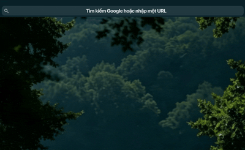 
      <b>Stay behind windows</b> 
      Keep the notch on the desktop layer, below maximized apps.
    </td>
  </tr>
  <tr>
    <td align="center" valign="top" width="50%">
      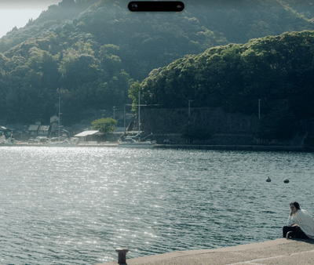 
      <b>Spotlight search</b> 
      Press Alt+Space to find apps and files or calculate an expression.
    </td>
    <td align="center" valign="top" width="50%">
      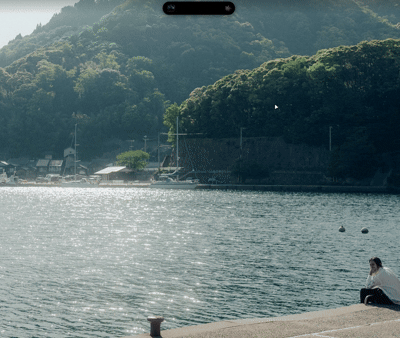 
      <b>Settings</b> 
      Adjust the notch’s appearance and behavior in Settings.
    </td>
  </tr>
</table>

## Usage

| Action                     | Result                                              |
| -------------------------- | --------------------------------------------------- |
| Hover                      | Expand the notch                                    |
| Click                      | Toggle pill / expanded view                         |
| Middle click               | Play / pause media                                  |
| Scroll down                | Switch to file shelf                                |
| Scroll up                  | Switch back to media controls                       |
| Swipe left / right         | Previous / next track                               |
| Swipe down                 | Open file shelf                                     |
| `Alt + Space`              | Open or close Spotlight                             |
| `Up` / `Down` in Spotlight | Move through results                                |
| `Tab` in Spotlight         | Switch between Search and AI                        |
| `Enter`                    | Launch selected item or send an AI message          |
| `Esc`                      | Stop an AI response, leave AI mode, or close Search |

<strong>File shelf actions</strong>

| Action          | Result                       |
| --------------- | ---------------------------- |
| Drag onto notch | Stage files                  |
| Lasso drag      | Select multiple staged files |
| `Ctrl + Click`  | Toggle selection             |
| Drag out        | Move to any target           |
| `Delete`        | Remove selected files        |

### Spotlight AI

In **Settings → Spotlight**, choose a default opening mode (Search or AI). Press `Alt + Space` to open Spotlight and `Tab` to switch modes.
Opening AI mode does not send a request; sending a message transmits it and recent conversation context directly to the selected provider.
API keys are encrypted in local settings with Windows DPAPI and excluded from settings exports. AI conversations are also encrypted locally; see the [Privacy Policy](PRIVACY_POLICY.md#48-spotlight-ai-opt-in) for storage, recipients, and deletion details.

## Installation

V-Notch runs on 64-bit Windows 10 build 19041 or later, or Windows 11. It requires [.NET 8 Desktop Runtime](https://dotnet.microsoft.com/download/dotnet/8.0) or [.NET 10 Desktop Runtime](https://dotnet.microsoft.com/download/dotnet/10.0). The self-contained installer includes the runtime. A dedicated GPU is recommended for Liquid Glass at 60-120 FPS.

1. Download `V-Notch-Setup.exe` from [Releases](https://github.com/rainaku/V-Notch/releases). Use `V-Notch-Setup-SelfContained.exe` to skip the .NET install.
2. Run the installer.
3. Launch V-Notch from the Start Menu or desktop shortcut.
4. Optionally enable "Start with Windows" in Settings.

<strong>Build with GitHub Actions</strong>

Open the Actions tab, select Release Installer, and click Run workflow. Choose `framework-dependent` (smaller, requires .NET runtime) or `self-contained` (standalone). Download the installer from Artifacts when the build finishes, or from the automated `nightly` release tag.

## Privacy

V-Notch does not collect telemetry or analytics, or track you. It makes network requests to the following services:

| Service                                              | Purpose                                                                            |
| ---------------------------------------------------- | ---------------------------------------------------------------------------------- |
| GitHub Releases API                                  | Update checks                                                                      |
| LRCLIB / lrc mux                                     | Synced lyrics                                                                      |
| YouTube / SoundCloud                                 | Public thumbnails and captions                                                     |
| Spotify Web Services                                 | Optional Canvas backgrounds; credentials encrypted with Windows DPAPI              |
| Open-Meteo / ipwho.is                                | Optional weather                                                                   |
| OpenAI / Google Gemini / Anthropic Claude / DeepSeek | Optional AI messages and conversation context; DeepSeek balance refresh on request |

Settings and several local caches are stored at `%APPDATA%\V-Notch\`. Encrypted AI chat history is stored separately at `%LOCALAPPDATA%\VNotch\spotlight-chats.enc`. Other component caches and temporary files are described in the Privacy Policy. Local Spotlight Search does not upload queries; Spotlight AI sends the content you submit to your selected provider.

> [!NOTE]
> **API Key Safety:** User-provided API credentials (OpenAI, Gemini, Claude, DeepSeek, YouTube) are encrypted locally with Windows DPAPI. V-Notch maintains no intermediary servers. Maintainers assume no liability for third-party billing, quota exhaustion, or credentials leaked from user environments or pre-release testing builds. Please configure spending caps on your provider accounts.

Privacy dots use capture reports from Windows and recording signals from Bandicam, OBS Studio, and FFmpeg. See [recording detection coverage and limitations](RECORDING_DETECTION.md).

[Privacy Policy](PRIVACY_POLICY.md) · [Tiếng Việt](PRIVACY_POLICY_VI.md) · [Terms of Service](TERMS_OF_SERVICE.md) · [Tiếng Việt](TERMS_OF_SERVICE_VI.md)

## Star history

Thank you to everyone who has supported V-Notch since the early releases. Your feedback and GitHub stars help keep the project going.

## License

V-Notch uses the Apache License 2.0. See [LICENSE](LICENSE) and [THIRD_PARTY_NOTICES.md](THIRD_PARTY_NOTICES.md).

  Made by <a href="https://rainaku.id.vn">rainaku</a> ·
  <a href="https://v-notch.vercel.app">Website</a> ·
  <a href="https://github.com/rainaku/V-Notch">GitHub</a> ·
  <a href="https://www.facebook.com/rain.107/">Facebook</a> ·
  <a href="https://www.paypal.me/PhuocLe678">Donate</a>

